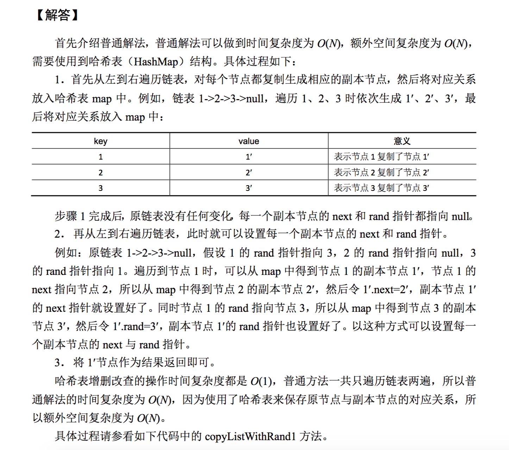

#### 题目:复制含有随机指针节点的链表

一种特殊的链表节点类描述如下:

```C++
struct RandomListNode 
{
    int label;
    RandomListNode *next, *random;
    RandomListNode(int x) : label(x), next(NULL), random(NULL) {}
};
```

Node类中的value是节点值，next指针和正常单链表中next指针的意义一样，都指向下一个节点，rand指针是Node类中新增的指针，这个指针可能指向链表中的任意一个节点，也可能指向null。给定一个由Node节点类型组成的无环单链表的头节点 head，请实现一个函数完成这个链表中所有结构的复制，并返回复制的新链表的头节点。要求除了需要返回的东西外，不再使用额外的数据结构并且在时间复杂度为 O(N)内完成原问题要实现的函数。


1. 两中解答方式,一种为利用hashmap记录对应关系,时间复杂度O(n),空间复杂度O(n)
    
2. 一种利用链表之间的关系,时间复杂度O(n),空间复杂度O(1)
    
